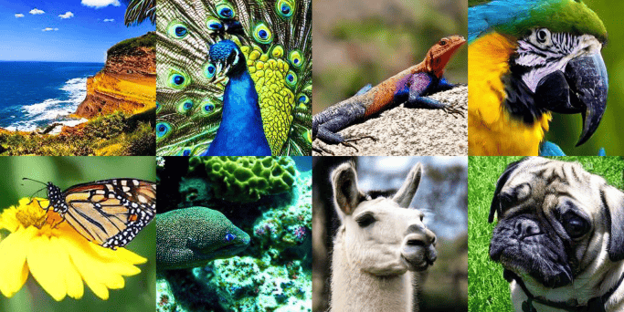
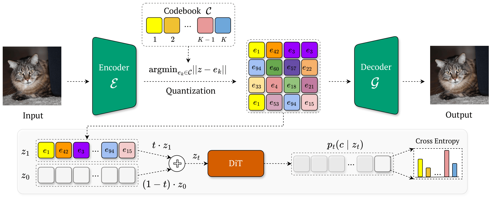

# Purrception: Variational Flow Matching for Vector-Quantized Image Generation

[](https://arxiv.org/abs/2510.01478)

This repository contains the official PyTorch implementation for [Purrception: Variational Flow Matching for Vector-Quantized Image Generation](https://arxiv.org/abs/2510.01478) (Conference Paper in the Main Track at ICLR 2026).



## 🐱 What is Purrception?

Purrception is a vector-quantized (VQ) image generation method based on [variational flow matching](https://arxiv.org/abs/2406.04843). The core innovation lies in its _hybrid_ approach: it samples images via continuous transport, but the learning is guided by discrete supervision on the codebook indices. This unique combination allows Purrception to inherit powerful properties from both continuous and discrete flow matching models, resulting in superior high-fidelity sample generation on ImageNet-1k 256 $\times$ 256.



## 🔨 Initial setup

### Virtual environment
To set up the virtual environment (Linux / MacOS), you can simply run:

```bash
python -m venv .venv
source .venv/bin/activate
pip install -r requirements.txt
```

### VQ checkpoints

The current codebase can be used together with the following VQ tokenizers:
- Stable Diffusion's ``vq-f8`` autoencoder, with a downsampling factor $f = 8$ and a codebook of shape 16 384 $\times$ 4. It can be downloaded from [here](https://ommer-lab.com/files/latent-diffusion/vq-f8.zip).
- LlamaGen's ``vq-ds8-c2i`` autoencoder, with a downsampling factor $f = 8$ and a codebook of shape 16 384 $\times$ 8. It can be downloaded from [here](https://huggingface.co/FoundationVision/LlamaGen/resolve/main/vq_ds8_c2i.pt).

The checkpoints must be added in the ``autoencoders/`` folder. More specifically, you should have in this folder the files ``autoencoders/vq-f8.ckpt`` and ``autoencoders/vq_ds8_c2i.pt``.

### 📚 Dataset preparation (ImageNet-1k 256×256 latents)

Training reads **pre-encoded VQ latents** from disk (WebDataset shards). The flow is:

1. **Raw images.** `get_latents.py` loads the train split of ImageNet-1k at 256×256 from Hugging Face ([`benjamin-paine/imagenet-1k-256x256`](https://huggingface.co/datasets/benjamin-paine/imagenet-1k-256x256)), using `datasets` with `cache_dir=./data` (see `dataset/imagenet.py`).
2. **VQ encode.** Images are normalized to **[-1, 1]**, passed through the chosen tokenizer (`vq-f8` or `vq-ds8-c2i`), and the **quantized latent tensors** (continuous embeddings after quantization) are written to disk.
3. **On-disk format.** Samples are stored as WebDataset `.tar` shards under:

   `data/latents/imagenet/<vq_latent>/`

   Each sample contains:
   - `latent.npy` — float32 array, VQ latent tensor for one image  
   - `cls_id.cls` — integer class index (0–999)

**Encode and save latents** (multi-GPU via `torchrun`; all ranks participate in inference, rank 0 writes shards—see `get_latents.py`):

```bash
torchrun --nproc_per_node=NUM_GPUS get_latents.py \
    --vq_latent vq-f8 \
    --batch_size 32 \
    --num_workers 16
```

Use `--vq_latent vq-ds8-c2i` for the LlamaGen tokenizer (requires the `LlamaGen` package in the repo and is resolved in code; the default checkpoint URL can be overridden by placing `autoencoders/vq_ds8_c2i.pt` as in the **VQ checkpoints** section).

**Tokenizer specifics**

- **`vq-f8`:** loads `autoencoders/vq-f8.ckpt` and `latent_diffusion/models/first_stage_models/vq-f8/config.yaml`.
- **`vq-ds8-c2i`:** loads the LlamaGen VQ-8 model (see `prepare_llamagen_autoencoder` in `get_latents.py`).

**Training dataloader expectations.** `trainer.py` builds a WebDataset path from the VQ checkpoint filename and **hard-coded shard ranges** for ImageNet:

- `vq-f8` → `./data/latents/imagenet/vq-f8/shard_{000000..000211}.tar`
- `vq-ds8-c2i` → `./data/latents/imagenet/vq-ds8-c2i/shard_{000000..000421}.tar`

If your encoding run produces a different number of shards, update the brace range in `_init_dataloader` in `trainer.py` to match your files.

## 🏋️ Training

Entry point: **`main.py`**. It parses CLI arguments (optionally grouped as backbone / autoencoder / trainer / sampler), loads a YAML config if `--config_path` is set, merges `backbone_args`, `autoencoder_args`, `trainer_args`, and `sampler_args` into those groups, derives `exp_name` when omitted, instantiates **`Trainer`**, and calls **`train()`**.

Core logic lives in **`trainer.py`** (`Trainer`):

- **Distributed setup:** reads `LOCAL_RANK`, `RANK`, `WORLD_SIZE`, initializes NCCL when needed, and wraps the DiT backbone with **DeepSpeed** (`deepspeed.initialize`, config from `zero2.json` by default via `--ds_config`).
- **VQ model:** `_prepare_autoencoder` loads either Stable Diffusion VQ (`stablediffusion`) or LlamaGen VQ (`llamagen`) for decoding/quantization during training—not for encoding the full dataset (that is done by `get_latents.py`).
- **Data:** `_init_dataloader` uses `utils.dataset_utils.SimpleImageDataset` over the ImageNet latent shards (see dataset preparation above).
- **Optimization:** AdamW, backward through DeepSpeed, gradient clipping from the DeepSpeed config; optional EMA.
- **Step:** `_train_step` implements the objective for `purrception`, `cfm`, `cfm-endpoint`, or `dfm` (see `trainer.py`).
- **Logging / checkpoints:** Weights & Biases, periodic sampling with the matching function from `utils/sample_utils.py`, and checkpoints via `checkpointer.py`.

**Launch example** (multi-GPU; set `NUM_GPUS`). Ready-made configs live under **`configs/examples/train/`** (one YAML per objective, backbone size, and tokenizer). The snippet below uses Purrception with DiT-B/2 on ImageNet latents from `vq-f8`; pick another file in that folder for `cfm`, `cfm-endpoint`, `dfm`, DiT-L/XL, or `vq-ds8-c2i`. `CUBLAS_WORKSPACE_CONFIG` is optional but commonly used for reproducible CUDA reductions:

```bash
CUBLAS_WORKSPACE_CONFIG=:4096:8 torchrun --nproc_per_node=NUM_GPUS main.py \
    --config_path configs/examples/train/train_purrception_dit-b-2_imagenet_vq-f8.yaml
```

**Resume** (load optimizer/state via checkpointer + DeepSpeed; pass the `*_last.pth` checkpoint you care about):

```bash
CUBLAS_WORKSPACE_CONFIG=:4096:8 torchrun --nproc_per_node=NUM_GPUS main.py \
    --config_path configs/examples/train/train_purrception_dit-b-2_imagenet_vq-f8.yaml \
    --resume \
    --load_checkpoint_path logs/<exp_name>/imagenet_dit_last.pth
```

**Example training YAML** (ImageNet, Purrception, DiT-B/2, VQ-f8)—mirrors `configs/examples/train/train_purrception_dit-b-2_imagenet_vq-f8.yaml` (`use_ema` and `use_log_z` are already set there; add CLI flags only if you want to override the file):

```yaml
model_type: purrception
backbone_type: dit
backbone_args:
  input_size: 32
  patch_size: 2
  in_channels: 4
  hidden_size: 768
  depth: 12
  num_heads: 12
  mlp_ratio: 4
  num_classes: 1000
autoencoder_args:
  autoencoder_type: stablediffusion
  autoencoder_checkpoint_path: autoencoders/vq-f8.ckpt
  autoencoder_config_path: latent_diffusion/models/first_stage_models/vq-f8/config.yaml
trainer_args:
  dataset: imagenet
  num_iterations: 4000000
  batch_size: 8
  use_amp: true
  amp_dtype: bfloat16
  gradient_accumulation_steps: 1
  lr: 1.0e-4
  num_workers: 16
  eval_every_n_steps: 5000
  save_every_n_steps: 5000
  save_new_every_n_steps: 50000
  cfg_scale: 1.0
  use_ema: true
  use_log_z: true
  lambda_z: 1.0e-5
sampler_args:
  num_samples: 4
  ode_method: euler
  ode_steps: 100
```

**CLI reference.** For every flag, see the argument groups in `main.py` (`add_trainer_args`, `add_backbone_args`, `add_autoencoder_args`, `add_sampling_args`, DeepSpeed flags). Config values override defaults when `--config_path` is provided.

<details>
<summary>Selected training parameters</summary>

- **`model_type`** — `purrception`, `cfm`, `cfm-endpoint`, or `dfm` (CLI choices in `main.py`).
- **`backbone_type`** — `dit`.
- **`autoencoder_checkpoint_path` / `autoencoder_config_path`** — must match the tokenizer used to build the latent shards (`vq-f8` vs `vq-ds8-c2i`).
- **`log_path_dir`** — root for logs; experiment folder is `log_path_dir / exp_name` (default `exp_name` includes model and backbone type and a timestamp unless set in YAML).
- **`eval_every_n_steps`** — how often to run sampling during training and log a grid to W&B.
- **`save_every_n_steps` / `save_new_every_n_steps`** — checkpoint frequency; the “new” checkpoint uses a `*_last.pth` name suitable for `--resume`.
- **`batch_size`** — per GPU (DeepSpeed micro-batch).
- **`resume` / `load_checkpoint_path`** — resume training state from a prior run.

</details>

---

### 🌊 Sampling and FID

**Batch sampling + optional FID:** use **`sample_checkpoints.py`**. It loads the same style of YAML as training (`model_type`, `backbone_args`, `autoencoder_args`, **`sampler_args`** for evaluation). It loads the VQ and DiT, optionally steps through **multiple checkpoints** derived from `--base_path` and `--steps`, generates images, writes them under `--samples_path`, and can compute FID against a local reference folder. Matching configs live under **`configs/examples/sample/`** (same naming pattern as training: objective, DiT size, tokenizer).

**Example sampling YAML** (10k images, Euler, class-balanced ImageNet sampling when `num_classes: 1000` and `--y` is not set)—same shape as `configs/examples/sample/sample_purrception_dit-b-2_imagenet_vq-f8.yaml`. FID is **not** configured in YAML; enable it on the CLI with **`--compute_fid`** (torch-fidelity).

```yaml
model_type: purrception
backbone_type: dit
backbone_args:
  input_size: 32
  patch_size: 2
  in_channels: 4
  hidden_size: 768
  depth: 12
  num_heads: 12
  mlp_ratio: 4
  num_classes: 1000
autoencoder_args:
  autoencoder_type: stablediffusion
  autoencoder_checkpoint_path: autoencoders/vq-f8.ckpt
  autoencoder_config_path: latent_diffusion/models/first_stage_models/vq-f8/config.yaml
sampler_args:
  total_number_samples: 10000
  batch_size_per_gpu: 50
  ode_method: euler
  ode_steps: 100
  cfg_scale: 1.0
```

**Typical invocation** (replace checkpoint base path and steps; `BASE` should be the path prefix used by your checkpointer, such that files like `BASE_step-100000.pth` and `BASE_last.pth` exist). Pair the config with the same model and tokenizer as training (e.g. `configs/examples/sample/sample_purrception_dit-b-2_imagenet_vq-f8.yaml`):

```bash
torchrun --nproc_per_node=NUM_GPUS sample_checkpoints.py \
    --config_path configs/examples/sample/sample_purrception_dit-b-2_imagenet_vq-f8.yaml \
    --base_path logs/<exp_name>/imagenet_dit \
    --steps 100000 200000 last \
    --samples_path results/my_run_samples \
    --compute_fid \
    --use_distributed
```

- **`utils/sample_utils.py`** implements the actual generators: `sample_purrception`, `sample_cfm`, `sample_cfm_endpoint`, and `sample_dfm` (ODE integration with `torchdiffeq`, optional temperature for Purrception, VQ **quantize** + **decode** / **decode_tokens** / LlamaGen **decode_code** paths for RGB images).
- **Temperature / ODE overrides:** CLI flags such as `--t_max_t_min`, `--ode_method`, `--ode_steps`, `--cfg_scale`, `--atol`, `--rtol` override YAML `sampler_args` when set.
- **FID inside `sample_checkpoints.py`:** pass **`--compute_fid`** to run **torch-fidelity** on the generated folder for each checkpoint step (FID, ISC, KID, PRC). Reference images must live under **`data/imagenet_256_images_validation`** (e.g. from `python download_imagenet_val.py`). Requires `pip install torch-fidelity`.

## 📎 Citation

In case you find this repository useful, please cite our paper:

```
@article{maticsan2025purrception,
  title={Purrception: Variational Flow Matching for Vector-Quantized Image Generation},
  author={Mati{\c{s}}an, R{\u{a}}zvan-Andrei and Hu, Vincent Tao and Bartosh, Grigory and Ommer, Bj{\"o}rn and Snoek, Cees GM and Welling, Max and van de Meent, Jan-Willem and Derakhshani, Mohammad Mahdi and Eijkelboom, Floor},
  journal={arXiv preprint arXiv:2510.01478},
  year={2025}
}
```

## Related repositories

This codebase builds on ideas and implementations from:

- [Latent Diffusion](https://github.com/CompVis/latent-diffusion)
- [Taming Transformers](https://github.com/CompVis/taming-transformers)
- [Diffusion Transformer (DiT)](https://github.com/facebookresearch/DiT)
- [Discrete Interpolants](https://github.com/CompVis/discrete-interpolants)
- [DuoDiff](https://github.com/razvanmatisan/duodiff)
